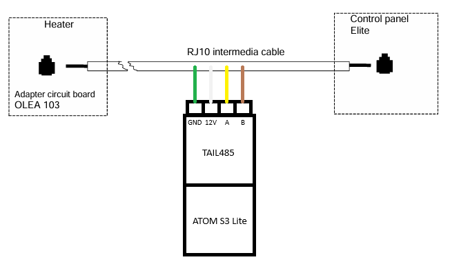

# ESPHome Sauna360

[ESPHome](https://esphome.io/) rs485 gateway component for brands of Sauna360 electrical sauna heaters.  

[ESPHome](https://esphome.io/) is a system to control your microcontrollers by simple yet powerful configuration files and control them remotely through Home Automation systems like [Home Assistant](https://www.home-assistant.io/) and [openHAB](https://www.openhab.org/).  

Brands, Sauna360, Helo, Tylö, TyloHelo, finnleo, amerec.  

which use Adapter circuit board OLEA 103 and PURE/ELITE control panels.  


Known models which have OLEA 103:  
Himalaya Elite, Roxx Elite, helo Steam, Helo Steam Pro, Rocher Elite, Contactor box WE30, WE40, WE 50, WE 53, WE 52.  
With contactor box you can make your traditional sauna heater to work with PURE/ELITE control panels.

Tested with:  
Helo Roxx, Contactor box WE30, with ELITE and PURE 2.0 panels  
Hardware tested:  
ATOM Lite + tail485  
ATOM S3 Lite + tail485  
ATOM S3 Lite + Max485 Module with ~RE/DE flow control pin  

## Connecting your device

> [!CAUTION]
> Max output power of 12VDC line is not known so connect devices at your OWN RISK!  

### Between panel and heater  
Cable (4 x 0,15 mm²) / (LIYY (TP) 2 x 2 x 0,14mm²)  
  

> [!WARNING]
> Colors may vary, so measuring voltage is advised. Turn heater of when making a connection.  

|PIN|DESIGNATION|COLOR|
|--|--|--|
|1|A|YELLOW|
|2|B|BROWN|
|3|12VDC|WHITE|
|4|GND|GREEN|

> [!IMPORTANT]
> If using automatic tranciever like tail485 and pure panel. An additional resistor of 220Ω is needed between A and B lines in order to make sending to work.

### Directly to heater OLEA 103

  
 
If errors in communications or long wire use twisted pair cable like LIYY (TP) 2 x 2 x 0,14   

Cable pinout, telephone jack RJ10:  
  
> [!WARNING]
> Cable pinout for common telephone cables. Colors may vary, so measuring voltage is advised.  

|PIN|DESIGNATION|COLOR|
|--|--|--|
|1|A|YELLOW OR BLACK|
|2|B|GREEN OR RED|
|3|12VDC|RED OR GREEN|
|4|GND|BLACK OR YELLOW|

> [!TIP]
> It is recommended to put ESPhome Wifi device outside of sauna. Typically there is foil behind woodpanels so wifi reception might be poor in saunaroom and devices probably don't like to heat up.  

## Configuration  

### Example minimal configuration.
```
uart:
    # change right pins for your ESPhome device
    rx_pin: GPIO1
    tx_pin: GPIO2
    baud_rate: 19200
    data_bits: 8
    parity: EVEN
    stop_bits: 1

sauna360:
  #flow_control_pin: GPIO7 #PIN to set transmit DE ~RE pins high on RS485 board

binary_sensor:
- platform: sauna360
  heater_status:
    name: "Heater Status"
- platform: sauna360
  light_status:
    name: "Light Status"
- platform: sauna360
  ready_status: 
    name: "Ready Status"

sensor:
- platform: wifi_signal
  name: "${device_name} WiFi Signal"
  update_interval: 60s
- platform: sauna360
  current_temperature:
    name: "Current Temperature"
- platform: sauna360
  setting_temperature:
    name: "Setting Temperature"
- platform: sauna360
  remaining_time:
    name: "Remaining time"
- platform: sauna360
  setting_bath_time:
    name: "Setting Bath Time"
- platform: sauna360
  humidity_setting: #combi/steam models
    name: "Setting Humidity"
- platform: sauna360
  humidity_percentage: #combi/steam models
    name: "Humidity"

button:
- platform: sauna360
  heater_on:
    name: "On"
- platform: sauna360
  heater_off:
    name: "Off "
- platform: sauna360
  heater_standby: #use only if elite panel and stanby setting is on from panel.
    name: "Standby"
- platform: sauna360
  heater_power_toggle:
    name: "Power Toggle"

number:
- platform: sauna360
  bath_time:
    name: "Bath Time"
    mode: box # box / slider
    bath_time_default: 90 #1-360min
- platform: sauna360
  bath_temperature:
    name: "Bath Temperature"
    mode: box # box / slider
    bath_temperature_default: 65 #40-110°C
```

### Example full configuration with m5stack ATOMS3 Lite + tail485
```
#example configuration

substitutions:
  device_name: helo

external_components:
  - source: esphome/components

esphome:
  name: ${device_name}
  friendly_name: ${device_name}
  comment: ${device_name} sauna controller
  area: Sauna
  platformio_options:
    board_build.flash_mode: dio

esp32:
  #change right board for your device
  board: esp32-s3-devkitc-1
  flash_size: 8MB
#  framework:
#    type: arduino #arduino or esp-idf tested on both

# Enable logging
logger:
  level: DEBUG
  # disable putting logging on the HW uart
  baud_rate: 0

# Enable Home Assistant API
api:

# Enable OTA updates and read logs with wifi
ota:
  - platform: esphome

wifi:
  ssid: !secret wifi_ssid
  password: !secret wifi_password
  power_save_mode: none
  #recommended to manually configure ip address
  manual_ip:
    # Set this to the IP of the ESPhome device
    static_ip: 192.168.1.192
    # Set this to the IP address of the router. Often ends with .1
    gateway: 192.168.1.1
    # The subnet of the network. 255.255.255.0 works for most home networks.
    subnet: 255.255.255.0

#for faster debug or as an interface take resources. should turn off if not in use
#web_server:
#  port: 80
#  version: 3

uart:
    # change right pins for your ESPhome device
    rx_pin: GPIO1
    tx_pin: GPIO2
    baud_rate: 19200
    data_bits: 8
    parity: EVEN
    stop_bits: 1

sauna360:
  #flow_control_pin: GPIO7 #PIN to set transmit DE ~RE pins high on RS485 board

binary_sensor:
- platform: sauna360
  heater_status:
    name: "Heater Status"
- platform: sauna360
  light_status:
    name: "Light Status"
- platform: sauna360
  ready_status: 
    name: "Ready Status"

sensor:
- platform: wifi_signal
  name: "${device_name} WiFi Signal"
  update_interval: 60s
- platform: sauna360
  current_temperature:
    name: "Current Temperature"
- platform: sauna360
  setting_temperature:
    name: "Setting Temperature"
- platform: sauna360
  remaining_time:
    name: "Remaining time"
- platform: sauna360
  setting_bath_time:
    name: "Setting Bath Time"
- platform: sauna360
  humidity_setting: #combi/steam models
    name: "Setting Humidity"
- platform: sauna360
  humidity_percentage: #combi/steam models
    name: "Humidity"

button:
- platform: sauna360
  heater_on:
    name: "On"
- platform: sauna360
  heater_off:
    name: "Off "
- platform: sauna360
  heater_standby: #use only if elite panel and stanby setting is on from panel.
    name: "Standby"
- platform: sauna360
  heater_power_toggle:
    name: "Power Toggle"

number:
- platform: sauna360
  bath_time:
    name: "Bath Time"
    mode: box # box / slider
    bath_time_default: 90 #1-360min
- platform: sauna360
  bath_temperature:
    name: "Bath Temperature"
    mode: box # box / slider
    bath_temperature_default: 65 #40-110°C

```
### Place your !secrets to secrets.yaml
```
wifi_ssid: "SSID"
wifi_password: "PASSWORD"
```